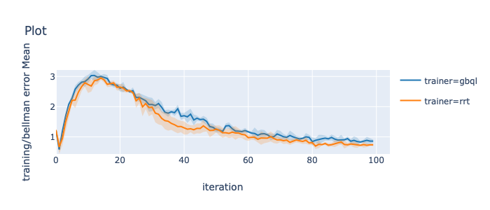

## Relational Q Learning

**Work in progress**

This repository contains implementation of following Relational Q-Learning algorithms.
 
1. Relational Regression Tree (RRT) by Džeroski et al. 2001. 
2. Relational Gradient Boosted Q-Learning (GBQL) as proposed by Das et al. 2020.

### Getting Started

1. Create python virtual environment
    
    ```shell script
    python3 -m venv rql-venv
    source rql-venv/bin/activate
    ```

2. Get the debug branch of the [srlearn fork](https://github.com/harshakokel/srlearn)
    
    ```shell script
    git clone git@github.com:harshakokel/srlearn.git
    git checkout --track origin/debug
    pip install -e .
    ```

3. Get this code 
    
    ```shell script
    git clone git@github.com:harshakokel/Relational-Q-Learning.git
    pip install -e .
    ``` 

4. Run the experiment
    
    ```shell script
    python experiments/rrt_stack.py
    python experiments/gbql_stack.py
    ```

### Visualize Results

[Viskit](https://github.com/harshakokel/viskit) is the recommended way to visualize all the experiment. 

```shell script
python viskit/frontend.py Relational-Q-learning/data/<exp_prefix>/
```

Here is a sample plot generated by viskit comparing the bellman error of RRT and GBQL for the blocksworld stack environment.




### Code organization

```bash
RePReL
├── README.md                       # this file 
├── core/                           # Relational Q-Learning core code
|  ├── data_management/             # contains buffer implementation for managing SARS 
|  ├── exploration_strategy/        # strategies for changing epsilon for exploration
|  ├── learning_rate_strategy/      # strategies for changing learning rate while training
|  ├── srl/                         # Wrapper for BoostSRL call, currently only enables caching.
|  ├── trainer/                     # RRT and GBQL learing algorithms.
|  └── util                         # logging utility code
├── data/                           # results from experiments
├── environments/                   # Symbolic Environments
|  ├──  blocksworld_stack.py        # Blocksworld stack environment
|  └──  ...  
├── experiments/                    # runner files for different experiments
```


### Credits

The relational learning part uses the [srlearn library by Alex Hayes](https://github.com/hayesall/srlearn) which internally uses [BoostSRL](https://github.com/starling-lab/BoostSRL) by Dr. Sriraam Natarajan and his lab. Some of the utility code is taken from the [Vitchyr Pong's RLkit code](https://github.com/vitchyr/rlkit).  Visualization kit is originally form [RL Lab](https://github.com/rll/rllab) and extracted by [Vitchyr Pong](https://github.com/vitchyr/viskit).

### References

[1] Džeroski, S., De Raedt, L., & Driessens, K. "[Relational reinforcement learning.](https://link.springer.com/article/10.1023/A:1007694015589)" Machine learning 2001.

[2] Das, S., & Natarajan, S., & Roy, K., & Parr, R., & Kersting, K., "[Fitted Q-Learning for Relational Domains](https://starling.utdallas.edu/assets/pdfs/KR_Fitted_Q.pdf)", International Conference on Principles of Knowledge Representation and Reasoning (KR) 2020.

[3] https://github.com/vitchyr/rlkit
